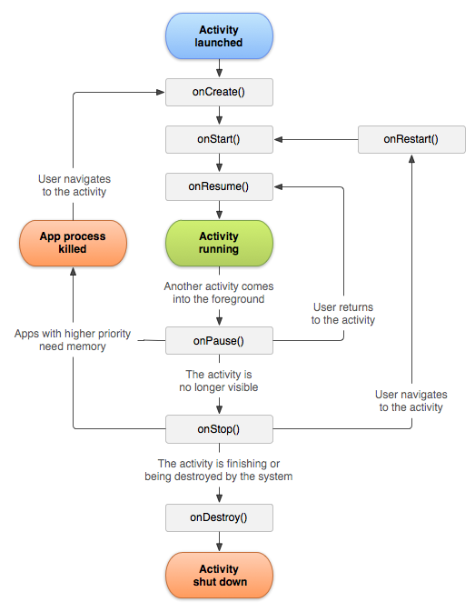

# Câu hỏi Android Cơ bản

- [Câu hỏi Android Cơ bản](#câu-hỏi-android-cơ-bản)
  - [4 Component chính trong Android là gì](#4-component-chính-trong-android-là-gì)
  - [Activity](#activity)
    - [So sánh onCreate() và onStart()?](#so-sánh-oncreate-và-onstart)
    - [Cách gởi Data từ Activity B \> A](#cách-gởi-data-từ-activity-b--a)
    - [Activity vs Fragment Activity vs AppCompatActivity](#activity-vs-fragment-activity-vs-appcompatactivity)
    - [Khi 1 activity đang chạy, ta nhấn nút Home thì activity đó đi vào những trạng thái nào](#khi-1-activity-đang-chạy-ta-nhấn-nút-home-thì-activity-đó-đi-vào-những-trạng-thái-nào)
    - [Khi 1 Activity đang chạy, ta chọn recent apps, quét qua để kill app đó thì activity đó đi vào những trạng thái nào](#khi-1-activity-đang-chạy-ta-chọn-recent-apps-quét-qua-để-kill-app-đó-thì-activity-đó-đi-vào-những-trạng-thái-nào)
    - [Khi 1 Activity đang chạy mà bị crash, activity đó đi vào trạng thái nào](#khi-1-activity-đang-chạy-mà-bị-crash-activity-đó-đi-vào-trạng-thái-nào)
    - [Khi đang ở trong Activity, xoay màn hình thì Activity đi vào những trạng thái nào](#khi-đang-ở-trong-activity-xoay-màn-hình-thì-activity-đi-vào-những-trạng-thái-nào)
    - [Khi đang ở trong Activity, mở 1 AlertDialog thì activity đi vào những trạng thái nào](#khi-đang-ở-trong-activity-mở-1-alertdialog-thì-activity-đi-vào-những-trạng-thái-nào)
    - [Tạo mới 1 Thread trong activity, khi mở activity mới thì Thread đó có còn chạy ko](#tạo-mới-1-thread-trong-activity-khi-mở-activity-mới-thì-thread-đó-có-còn-chạy-ko)
    - [MediaPlayer đang chạy trong, tạo mới activity khác, player đó còn chạy ko](#mediaplayer-đang-chạy-trong-tạo-mới-activity-khác-player-đó-còn-chạy-ko)
    - [lúc nào onDestroy() được gọi mà không có onPause() và onStop()?](#lúc-nào-ondestroy-được-gọi-mà-không-có-onpause-và-onstop)
    - [tại sao chỉ nên gọi setContentView() trong onCreate()](#tại-sao-chỉ-nên-gọi-setcontentview-trong-oncreate)
  - [Fragment](#fragment)
    - [Trình bày LifeCycle của Fragment](#trình-bày-lifecycle-của-fragment)
    - [phân biệt activity và fragment](#phân-biệt-activity-và-fragment)
    - [Khi nào thì dùng Fragment, cho ví dụ trong thực tế. (Khi nào dùng Fragment thay cho Activity?)](#khi-nào-thì-dùng-fragment-cho-ví-dụ-trong-thực-tế-khi-nào-dùng-fragment-thay-cho-activity)
    - [Nếu thêm nhiều Fragment vào cùng 1 FrameLayout bằng FragmentManager thì thực tế hiển thị fragment nào, các fragment kia rơi vào trạng thái gì](#nếu-thêm-nhiều-fragment-vào-cùng-1-framelayout-bằng-fragmentmanager-thì-thực-tế-hiển-thị-fragment-nào-các-fragment-kia-rơi-vào-trạng-thái-gì)
    - [Giải thích Back stack fragment manager](#giải-thích-back-stack-fragment-manager)
  - [UI](#ui)
    - [Constrain layout](#constrain-layout)
    - [Dialog vs Fragment dialog](#dialog-vs-fragment-dialog)
    - [Khác nhau include và merge](#khác-nhau-include-và-merge)
    - [làm sao biết view nào tiêu tốn nhiều tài nguyên ( dùng cái gì)](#làm-sao-biết-view-nào-tiêu-tốn-nhiều-tài-nguyên--dùng-cái-gì)
    - [So sánh LinearLayout và ConstrainLayout](#so-sánh-linearlayout-và-constrainlayout)
    - [Sự khác nhau giữ View.GONE và View.INVISIBLE](#sự-khác-nhau-giữ-viewgone-và-viewinvisible)
    - [Giải thích dp, dpi, pt, sp trong Android](#giải-thích-dp-dpi-pt-sp-trong-android)
    - [Cho biết công thức quy đổi giữa px và dp](#cho-biết-công-thức-quy-đổi-giữa-px-và-dp)
    - [RecyclerView](#recyclerview)
      - [Viewholder là gì](#viewholder-là-gì)
      - [làm recycler view giống view pager](#làm-recycler-view-giống-view-pager)
      - [Thay đổi 1 Phần ViewHolder](#thay-đổi-1-phần-viewholder)
      - [RecylerView Kiểm tra 2 item không trùng](#recylerview-kiểm-tra-2-item-không-trùng)
  - [Service](#service)
    - [Phân biệt Service và IntentService](#phân-biệt-service-và-intentservice)
    - [Phân biệt Service, Intent Service, AsyncTask và Thread.](#phân-biệt-service-intent-service-asynctask-và-thread)
    - [Service Android 8.0](#service-android-80)
    - [Foreground và Background Service là gì, Bound service là gì](#foreground-và-background-service-là-gì-bound-service-là-gì)
    - [có mấy cách để start service](#có-mấy-cách-để-start-service)
    - [ThreadPool (thuộc java)](#threadpool-thuộc-java)
  - [Intent](#intent)
    - [Phân biệt Implicit và Explicit Intent](#phân-biệt-implicit-và-explicit-intent)
  - [Giải thích về 4 launchmode: standard, singleTop, singleTask, singleInstance](#giải-thích-về-4-launchmode-standard-singletop-singletask-singleinstance)
  - [Phân biệt Serializable và Parcelable, cái nào tốt hơn](#phân-biệt-serializable-và-parcelable-cái-nào-tốt-hơn)
  - [ANR là gì, khi nào nó xảy ra: Application not responding](#anr-là-gì-khi-nào-nó-xảy-ra-application-not-responding)
  - [Liệt kê một số thư viện http đã dùng](#liệt-kê-một-số-thư-viện-http-đã-dùng)
  - [Rest APIs là gì, tại sao lại dùng nó](#rest-apis-là-gì-tại-sao-lại-dùng-nó)
  - [Tại sao Android dùng db SQLite](#tại-sao-android-dùng-db-sqlite)
  - [Android Gradle là gì](#android-gradle-là-gì)
  - [Dependency injection là gì](#dependency-injection-là-gì)
  - [Làm thế nào để upload 1 file ảnh trong máy Android lên server](#làm-thế-nào-để-upload-1-file-ảnh-trong-máy-android-lên-server)
  - [Application](#application)
  - [Context](#context)
  - [Tại sao bytecode không thể chạy được trong Android?](#tại-sao-bytecode-không-thể-chạy-được-trong-android)
  - [Memory leak xảy ra khi nào?](#memory-leak-xảy-ra-khi-nào)
    - [Phòng tránh memory leak](#phòng-tránh-memory-leak)
  - [Unit test](#unit-test)
    - [How to write code for easier unit testing](#how-to-write-code-for-easier-unit-testing)
  - [1 màn hình có 4 button để upload hình, và 1 nút Save](#1-màn-hình-có-4-button-để-upload-hình-và-1-nút-save)
  - [dependency injection - Tiêm phụ thuộc](#dependency-injection---tiêm-phụ-thuộc)
  - [Các bước vẽ trên GG Map](#các-bước-vẽ-trên-gg-map)
  - [Các bước Push Notification Firebase](#các-bước-push-notification-firebase)
  - [Các bước thanh toán google billing](#các-bước-thanh-toán-google-billing)
  - [Các câu hỏi khác](#các-câu-hỏi-khác)
    - [...Là gì? dùng trong trường hợp nào](#là-gì-dùng-trong-trường-hợp-nào)
  - [Reference](#reference)

## 4 Component chính trong Android là gì

1. Activities
Ra lệnh cho UI, sử lý sự kiện người dùng trên màn hình hiện tại
Là màn hình nhỏ, riêng lẻ

2. Services
Xử lý tiến trình chạy nền

3. Broadcast Receivers (nhận dự báo)
Xử lý giao tiếp Android và Người dùng

4. Content Providers
Xử lý dữ liệu, quản lý vấn đề

## Activity



OnCreate - onStart (onRestart) - onResume
OnPause - OnStop - onDestroy

- OnCreate: Activity Tạo lần đầu.
- OnStart: Activity hiển thị với User. xoay màn hình.
- OnResume: Gọi khi sau khi activity hiển thị lần nữa, sau khi ẩn đi bởi onPause.

- OnPause: Activity ẩn, nằm sau Activity khác (nhưng còn thấy, vd: ẩn sau FragmentDialog).
- OnStop: Activity ẩn hoàn toàn với user. không thấy nó nữa.
- OnDestroy: Activity bị giết bởi User hay Hệ thống.

- **English:**

- OnCreate: Call on Activity first create. Screen Rotate.
- OnStart: Activity become visible to user.
- OnResume:  After hidden, Visible Again to user.

- OnPause: Activity hidden, below other Activity, but we can see it.
- OnStop: Activity invisible to user. we can not see it.
- OnDestroy: Activity had be kill by User, or System.

### So sánh onCreate() và onStart()?

OnCreate: gọi khi Activity khởi tạo lần đầu, 
OnStart: gọi khi Activity hiển thị với người dùng.

Khi User quay lại Activity, gọi OnRestart > OnResume. 
Sau khi ứng dụng bị thu hồi bộ nhớ, gọi OnCreate lại.

**English**

OnCreate: call on Activity first create, 
OnStart: Activity become visible to user.

When user comeback Activity, call OnRestart then OnResume. 
If app had been gabage memory, call OnCreate again.

### Cách gởi Data từ Activity B > A

1. Intent
put Extra to Inent, then start Activity with this Intent. 
   Intent intent = new Intent(ActA.this, ActB.class);
   intent.putExtra("key", sessionId);
   startActivity(intent);
ActivityB get 
   getIntent().getStringExtra("key").

2. Bundle
   Bundle b = new Bundle();
   b.putString("key", "value");
   indent.putExtra(b);

3. Use Static Medthod:
   String data = ActA.getData();

4. Shared Preferences
SharedPreferences sharedPref = getActivity().getPreferences(Context.MODE_PRIVATE);
SharedPreferences.Editor editor = sharedPref.edit();
editor.putInt(getString(R.string.saved_high_score_key), newHighScore);
editor.commit();

5. Database: SQLite, TextFile, ObjectFile

6. EventBus Third library, like: greenrobot EventBus

### Activity vs Fragment Activity vs AppCompatActivity

- Activity là lớp cơ sở
- Fragment Activity (extend Activity) có kèm quản lý fragment
- AppCompatActivity (extend FragmentActivity) có 1 số hàm tương thích Api Cũ

### Khi 1 activity đang chạy, ta nhấn nút Home thì activity đó đi vào những trạng thái nào

onPause -> onStop

### Khi 1 Activity đang chạy, ta chọn recent apps, quét qua để kill app đó thì activity đó đi vào những trạng thái nào

onPause -> onStop -> onDestroy

### Khi 1 Activity đang chạy mà bị crash, activity đó đi vào trạng thái nào

onStop or onDestroy.
Tùy vị trí Crash Activity hay Application.

### Khi đang ở trong Activity, xoay màn hình thì Activity đi vào những trạng thái nào

onStart -> onResume

### Khi đang ở trong Activity, mở 1 AlertDialog thì activity đi vào những trạng thái nào

Không có

### Tạo mới 1 Thread trong activity, khi mở activity mới thì Thread đó có còn chạy ko

Vẫn chạy kể cả khi finish Activity

### MediaPlayer đang chạy trong, tạo mới activity khác, player đó còn chạy ko

Vẫn chạy

### lúc nào onDestroy() được gọi mà không có onPause() và onStop()?

Khi finish() được gọi ở trong phương thức onCreate()

### tại sao chỉ nên gọi setContentView() trong onCreate()

onCreate chỉ gọi một lần
onResume onStart: gọi nhiều lần, tốn tài nguyên

## Fragment

là UI Độc lập
hiển thị 1 phần trong Activity
có thể sử dụng nhiều lần.
có thể dùng như 1 màn hình riêng biệt
VD: nội dung của tab, a Dialog, a list, a ui of slider...

Fragment là một phần giao diện người dùng hoặc hành vi của một ứng dụng. Fragment có thể được đặt trong Activity, nó có thể cho phép thiết kế activity với nhiều mô-đun. Có thể nói Fragment là một loại sub-Activity. Fragment cũng có layout của riêng của nó, cũng có các hành vi và vòng đời riêng.

### Trình bày LifeCycle của Fragment


### phân biệt activity và fragment

Fragment là một phần giao diện người dùng hoặc hành vi của một ứng dụng. 
Fragment có thể được đặt trong Activity, nó có thể cho phép thiết kế activity với nhiều mô-đun. Tái sử dụng trong nhiều Activity.
Có thể nói Fragment là một loại sub-Activity. 
Fragment cũng có layout của riêng của nó, cũng có các hành vi và vòng đời riêng.

### Khi nào thì dùng Fragment, cho ví dụ trong thực tế. (Khi nào dùng Fragment thay cho Activity?)

Hiển thị 1 phần trong Activity, có thể sử dụng nhiều lần.
Hiển thị 1 màn hình trong Single Activity.
Ví dụ: nội dung của tab, a Dialog, a list, a ui of slider...

### Nếu thêm nhiều Fragment vào cùng 1 FrameLayout bằng FragmentManager thì thực tế hiển thị fragment nào, các fragment kia rơi vào trạng thái gì

- Hiển thị tất cả chồng lên nhau.
- Không rơi vào trạng thái nào. Trạng thái cuối là onResume

### Giải thích Back stack fragment manager

```java
// Thêm Fragment vào View(fragment_container)
// Hiện cả 2, không Pause Fragment cũ
MyFragment fragment = new MyFragment();
transaction.add(R.id.fragment_container, fragment, "fragment_tag");

// Xóa Fragment (destroy fragment)
transaction.remove(fragment);
// Thay thế Fagment hiện tại = fragment = remove + add (Pause fragment cũ)
transaction.replace(R.id.fragment_container, fragment, "fragment_tag");

// giống Remove, không đính kèm, còn lưu trạng thái (TAG)
transaction.detach(fragment);
// đính kèm Fragment bị Detach trở lại, (findFragmentByTag() != null)
transaction.attach(fragment);
```

## UI

### Constrain layout

Là Container View,
View con có mối quan hệ, ràng buộc với nhau và Parent View.
Tương tự như RelativeLayout, nhưng linh hoạt hơn.
Dễ sử dụng với Layout Editor của Android Studio.

**English**

It is a Container View, 
All Child View have a relationship, constrain together and parent layout.
Similar to RelativeLayout, but more flexible.
Easy to use with Android Studio's Layout Editor.

### Dialog vs Fragment dialog

- Hiện Fragment theo dạng Dialog, dialog phức tạp, tái sử dụng, khuyến khích dùng

### Khác nhau include và merge

- merge: áp dụng lớp Container chứa Include
- <LinearLayout><include></Linearlayout>
- <merge>123...</merge> => <LinearLayout>123...</Linearlayout>

### làm sao biết view nào tiêu tốn nhiều tài nguyên ( dùng cái gì)

- Profiler: check thông tin tài nguyên hệ thống (cpu, ram) android khi mở View đó

### So sánh LinearLayout và ConstrainLayout

- LinearLayout: các View con sắp theo 1 chiều (dọc, ngang).
- ConstrainLayout: các View con sắp xếp có liên kết với nhau.

### Sự khác nhau giữ View.GONE và View.INVISIBLE

- Gone: View biến mất, không giữ kích thước.
- Invisible: View biến mất, vẫn giữ kích thước.

### Giải thích dp, dpi, pt, sp trong Android

- dpi: (Dot per inch) là số lượng điểm ảnh hiển thị trên mỗi inch màn hình
- Pt:  1/72 inch kích thước màn hình.
- dp: density independent pixel. Phụ thuộc mật độ điểm ảnh.
- Sp: scale independent pixel. Co theo mật độ điểm ảnh.

### Cho biết công thức quy đổi giữa px và dp

```java
public static float convertDpToPixel(float dp, Context context){
    return dp * ((float) context.getResources().getDisplayMetrics().densityDpi / DisplayMetrics.DENSITY_DEFAULT);
}

public static float convertPixelsToDp(float px, Context context){
    return px / ((float) context.getResources().getDisplayMetrics().densityDpi / DisplayMetrics.DENSITY_DEFAULT);
}
```

### RecyclerView

#### Viewholder là gì

Thiết kế cho Custom Adapter.
Mô tả Item View và Dữ liệu trong RecyclerView.
Giúp không cần dùng findViewId như trong ListView

#### làm recycler view giống view pager

SnapHelper Decoration

#### Thay đổi 1 Phần ViewHolder

onBindViewHolder payloads

#### RecylerView Kiểm tra 2 item không trùng

DiffUtil

## Service

### Phân biệt Service và IntentService

Service: Có thể chạy vô thời hạn.
IntentService: Tự dừng lại sau khi trả về kết quả, hay hàm **“onHandleIntent”** xử lý xong.

### Phân biệt Service, Intent Service, AsyncTask và Thread.

- Service: Là 1 Android Component. dùng để thực hiện các tác vụ ngầm ở background, ví dụ như chơi nhạc. Chạy trong Main Theard. Nó không có giao diện người dùng (user interface).
- IntentService: là 1 Android Service. Tự dừng lại sau khi trả về kết quả, hay hàm **“onHandleIntent”** xử lý xong.
- Thread: là một luồng thực thi tuần tự trong một chương trình. Thread có thể được coi là một mini-process chạy ở trong main process.
- AsyncTask: Thực hiện các công việc bất đồng bộ. Chạy trong background thread và publish kết quả lên trên UI thread. Mà Không yêu cầu bạn phải xử lý cách các thread hay handler hoạt động.

- Service: Là 1 Android Component, có thể Chạy Ngầm, ngay cả khi người dùng không tương tác. Chạy trong Main Thread.
- AsyncTask: Chạy trong Background Thread, chỉ chạy trong khi người dùng còn tương tác ứng dụng.

- https://developer.android.com/guide/components/services

### Service Android 8.0

- Background Service: Chạy độc lập, không cần giao diện. Giới hạn tác vụ chạy nền, chỉ chạy vài phút 
- Foreground Service: chạy khi có Activity đang chạy, hay kèm Notification

### Foreground và Background Service là gì, Bound service là gì

- Foreground Service: thực hiện hoạt động mà người dùng chú ý. (vd: nghe nhạc)
- Background Service: thực hiện hoạt động chạy ngầm. không cần báo người dùng.
- Bound Service: Component ràng buộc Service để lấy kết quả liên tục (như Client-Server)

### có mấy cách để start service

- Dùng StartService 
  - bằng class name
  - bằng text, dùng tên package + service

### ThreadPool (thuộc java)

Quản lý, điều tiết nhiều Thread

## Intent

### Phân biệt Implicit và Explicit Intent

- Explicit Intent: tường minh, gọi trực tiếp tên ứng dụng
- Implicit Intent: ẩn ý, gọi chung chung, ứng dụng nào chạy thì chạy

## Giải thích về 4 launchmode: standard, singleTop, singleTask, singleInstance

- Standard: nhiều Activity tồn tại (khởi tạo nhiều lần)
- SingleTop: nhiều Activity tồn tại (khởi tạo nhiều lần). Nếu Activity đã khởi tạo ở trên cùng, chỉ gọi hàm onNewIntent. Nếu không trên cùng thì khởi tạo lại.
- SingleTask: Chỉ 1 Activity tồn tại. Nếu Activity đã khởi tạo, destroy các Activity sau nó.
- singleInstance: Chỉ 1 Activity tồn tại, Activity chạy Task khác. Nếu Activity đã khởi tạo, sẽ nhảy lên trên.

## Phân biệt Serializable và Parcelable, cái nào tốt hơn

- Serializable: Chuyển Object(data) thành 1 dạng lưu trữ (text để lưu trữ và phục hồi)
- Parcelable: Gởi Object(data) thông qua các Bunble trong Android

## ANR là gì, khi nào nó xảy ra: Application not responding

- ANR: Ứng dụng đóng băng, không phải hồi cử chỉ người dùng.

## Liệt kê một số thư viện http đã dùng

- Retrofit, HttpRequest

## Rest APIs là gì, tại sao lại dùng nó

- REST (Representation State Stranfer): một tiêu chuẩn dùng trong việc thết kế các thiết kế API cho các ứng dụng web.
- API (Application Programming Interface): Giao diện lập trình ứng dụng.
- RESTful API: ứng dụng sử dụng REST

## Tại sao Android dùng db SQLite

- Không phải cài đặt
- Không cần mô hình Client - Server
- Chỉ lưu trữ 1 file
- Chiếm ít bộ nhớ
- Hỗ trợ truy vấn SQL

## Android Gradle là gì

- Gradle là một hệ thống tự động build mã nguồn mở

## Dependency injection là gì

- Là phương pháp giảm sự phụ thuộc 1 module trong 1 module
- Thay vì khởi tạo 1 object trong 1 object, ta khởi tạo nó bên ngoài. Rồi tim vào bên trong qua: constructer, setter, interface...

## Làm thế nào để upload 1 file ảnh trong máy Android lên server

- Tạo 1 Restfull Api upload ảnh
- Upload ảnh bằng thư viện Retrofit

## Application

- Application là lớp cơ sở trg Android App.
- Chứa tất cả Component khác (activity, service...)
- Khởi tạo đầu tiên, khi ứng dụng được chạy.

## Context

- Context: Cung cấp thông tin, quyền truy cập thông tin, trạng thái ứng dụng.
- ApplicationContext: ngữ cảnh của Toàn ứng dụng
- BaseContext: lấy ngữ cảnh có thể sử dụng
- getContext trong View: lấy ngữ cảnh tạo View

## Tại sao bytecode không thể chạy được trong Android?

Android sử dụng DVM - Dalvik Virtual Machine và và ART - Android Runtime (>5.0)
Không dùng: JVM (Java Virtual Machine)

## Memory leak xảy ra khi nào?

Since the AsyncTask maintains a reference to the previous instance of the Activity, that Activity won’t be garbage collected, resulting in a memory leak.

### Phòng tránh memory leak

Không giữ reference của view bên trong AsyncTask
Không giữ reference của View ở đối tượng static
Tránh đưa các Views vào trong Collection, bạn có thể sử dụng WeakHashMap
Dùng Leak-Canary để hiển thị biến leak

## Unit test

unit test: kiểm thử method test.

### How to write code for easier unit testing

using Dependency injection.
create a method for every fuction.
divice module for every mission. like: model, view, controller, data, helper.

## 1 màn hình có 4 button để upload hình, và 1 nút Save

- Khi click 4 button thì chọn hình và upload, 4 hình upload chạy song song, khi nhấn nút Save thì làm sao để đợi 4 hình upload xong thì mới gọi API của nút Save

First Way:
We can use a flag variable to count Finish upload.
when every upload finish, we will check it.

Second Way:
we can use AsyncTask to Check. we run upload onDoinBackground, then check it onPostExcute

Third Way:
We use third library like RxAndroid. 
we put all Upload method into Observable Zip method. 
then Check finish on Subscribe method

## dependency injection - Tiêm phụ thuộc

dependency: phụ thuộc.
injected: tiêm, bơm.

Làm giảm sự phụ thuộc của module này trong module kia
Giảm khởi tạo Lớp trong lớp

It is a method to reduce dependency module in side a other module.
Dont create Module's Instance in side an other Module.
We need provide module by other way, like: constructer, setter, interface...

It will easier for unit test, upgrade, update, module.

annotations thirth library, like: dagger, hilt

## Các bước vẽ trên GG Map

- Tạo Google Player Service Project, lấy API_KEY
- Đăng kí key trong Manifest
- Cài Map Dependencies trong Gradle
- Khởi tạo Map trên View, và kolin file
- Khi Map Ready thì gọi hàm Vẽ

- https://developers.google.com/maps/documentation/android-sdk/polygon-tutorial

## Các bước Push Notification Firebase

- Tạo project, lấy key trên Firebase Console
- Đăng kí key trong Manifest
- Cài Dependencies trong Gradle
- Tạo file FirebaseMessagingService để hiện thông báo
- Xin quyền hiện Notification trong app trước khi hiện thông báo

## Các bước thanh toán google billing

- Tạo project, lấy key trên Google Cloud Console
- Tạo danh sách sản phẩm
- Đăng kí key trong Manifest
- Cài Dependencies trong Gradle
- Khi User nhấn thanh toán: 
  - lấy danh sách sản phẩm về, hiện lên
  - User thanh toán sản phẩm, Kiểm tra: thành công, thất bại, pedding
  - Nếu thành công thì gọi Consume sản phẩm
  - Nếu Pedding thì hiện thông báo, khi mở app Sẽ consume sản phẩm

- https://viblo.asia/p/in-app-purchase-trong-android-phan-2-naQZRMwjKvx

## Các câu hỏi khác
### ...Là gì? dùng trong trường hợp nào

Thuật toán tìm đường đi ngắn nhất, qua nhiều điểm
Thuật toán sắp xếp kho hàng

- FragA->add FragB a qua trạng thái nào-> replace B with C B qua trạng thái nào->popC thì C qua trạng thái nào và A như thế nào
- nếu a bằng null gọi m a khác null gọi n ko dùng if
- viết When có trường hợp loại trừ

---

## Reference

<https://viblo.asia/p/mot-so-cau-hoi-phong-van-android-ban-nen-luu-y-phan-1-3Q75wkLQ5Wb>

---
