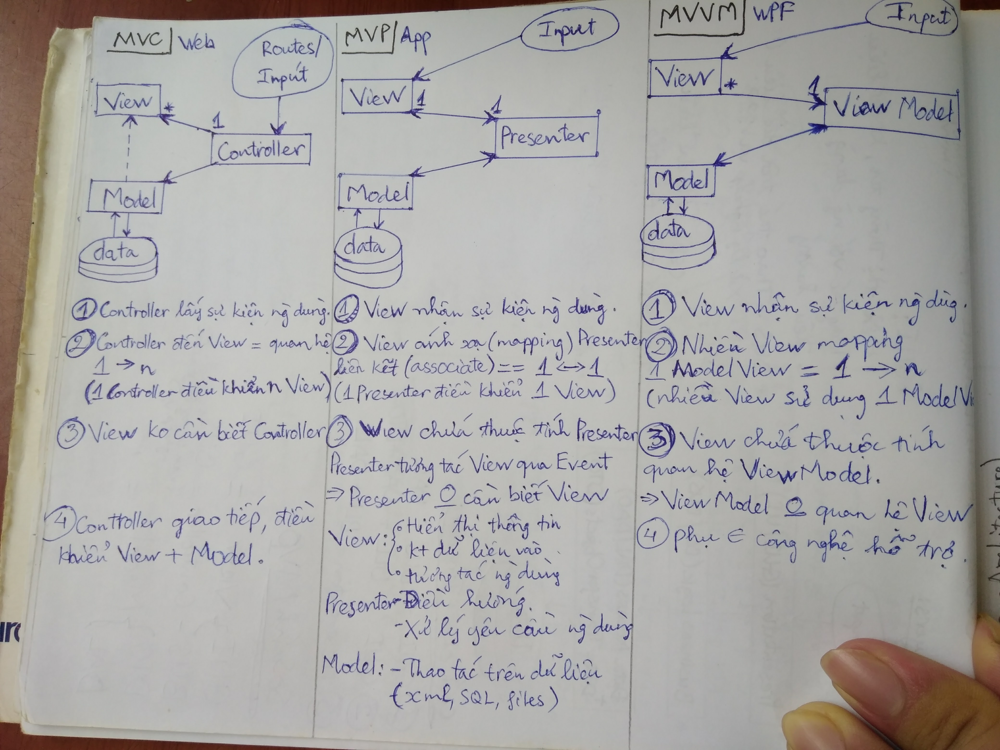

# Các câu hỏi phỏng vấn công ty cũ

- [Các câu hỏi phỏng vấn công ty cũ](#c%c3%a1c-c%c3%a2u-h%e1%bb%8fi-ph%e1%bb%8fng-v%e1%ba%a5n-c%c3%b4ng-ty-c%c5%a9)
  - [1. activity lifecycle](#1-activity-lifecycle)
  - [2. What’s the difference between onCreate() and onStart()?](#2-whats-the-difference-between-oncreate-and-onstart)
  - [3. When should you use a Fragment, rather than an Activity?](#3-when-should-you-use-a-fragment-rather-than-an-activity)
  - [4. Memory leak xảy ra khi nào?](#4-memory-leak-x%e1%ba%a3y-ra-khi-n%c3%a0o)
    - [Phòng tránh memory leak](#ph%c3%b2ng-tr%c3%a1nh-memory-leak)
  - [5. describe mvvm, mvvm vs mvc, why mvvm](#5-describe-mvvm-mvvm-vs-mvc-why-mvvm)
  - [6. dependency injection - Tiêm phụ thuộc](#6-dependency-injection---ti%c3%aam-ph%e1%bb%a5-thu%e1%bb%99c)
  - [7. unit test: how to write code for easier unit testing](#7-unit-test-how-to-write-code-for-easier-unit-testing)
  - [8. how many ways to send data back from Activity B > A](#8-how-many-ways-to-send-data-back-from-activity-b--a)
  - [9. constrain layout](#9-constrain-layout)
  - [10. 1 màn hình có 4 button để upload hình, và 1 nút Save](#10-1-m%c3%a0n-h%c3%acnh-c%c3%b3-4-button-%c4%91%e1%bb%83-upload-h%c3%acnh-v%c3%a0-1-n%c3%bat-save)

## 1. activity lifecycle

OnCreate - onStart (onRestart) - onResume
OnPause - OnStop - onDestroy

- OnCreate: Call on Activity first create.
Screen Rotate.
- OnStart: Activity become visible to user.
- OnResume:  After hidden, Visible Again to user.
- OnPause: Activity hidden, below other Activity, but we can see it.
- OnStop: Activity invisible to user. we can not see it.
- OnDestroy: Activity had be kill by User, or System.

## 2. What’s the difference between onCreate() and onStart()?

OnCreate: call on Activity first create, 
OnStart: Activity become visible to user.

When user comeback Activity, call OnRestart then OnResume. 
If app had been gabage memory, call OnCreate  again.

## 3. When should you use a Fragment, rather than an Activity?

Fragment là một phần giao diện người dùng hoặc hành vi của một ứng dụng. Fragment có thể được đặt trong Activity, nó có thể cho phép thiết kế activity với nhiều mô-đun. Có thể nói Fragment là một loại sub-Activity. Fragment cũng có layout của riêng của nó, cũng có các hành vi và vòng đời riêng.

We need a independent ui, to display on activity. 
It a part of Activity.
Modular section of Activity.

Content of a tab, a Dialog, a list, a ui of slider...

## 4. Memory leak xảy ra khi nào?

Since the AsyncTask maintains a reference to the previous instance of the Activity, that Activity won’t be garbage collected, resulting in a memory leak.

### Phòng tránh memory leak

Không giữ reference của view bên trong AsyncTask
Không giữ reference của View ở đối tượng static
Tránh đưa các Views vào trong Collection, bạn có thể sử dụng WeakHashMap
Dùng Leak-Canary để hiển thị biến leak

## 5. describe mvvm, mvvm vs mvc, why mvvm

MVVM: design pattern.
View: interactive with user, show infomation, gét user input.
Model: handle with data, sqlite, file
3 Layer.
ViêwModel: connect View& ViewModel, handle demand from view.

View get Event from User
Multiple View mapping 1 ModelView
View contain relation properties to ViewModel
belong support technology, Need a libary to use

MVC:
Controller get Event from User
1 Controller relate, control to multi View
Controller control View + Model
Longger code

## 6. dependency injection - Tiêm phụ thuộc

dependency: phụ thuộc.
injected: tiêm, bơm.

It is a method to reduce dependency module in side a other module.
Dont create Module's Instance in side an other Module.
We need provide module by other way, like: constructer, setter, interface...

It will easier for unit test, upgrade, update, module.

annotations thirth library, like: dagger 2

## 7. unit test: how to write code for easier unit testing

unit test: kiểm thử method test.

using Dependency injection.
create a method for every fuction.
divice module for every mission. like: model, view, controller, data, helper.

## 8. how many ways to send data back from Activity B > A

1. Intent
put Extra to Inent, then start Activity with this Intent. 
   Intent intent = new Intent(ActA.this, ActB.class);
   intent.putExtra("key", sessionId);
   startActivity(intent);
ActivityB get 
   getIntent().getStringExtra("key").

2. Bundle
   Bundle b = new Bundle();
   b.putString("key", "value");
   indent.putExtra(b);

3. Use Static Medthod:
   String data = ActA.getData();

4. Shared Preferences
SharedPreferences sharedPref = getActivity().getPreferences(Context.MODE_PRIVATE);
SharedPreferences.Editor editor = sharedPref.edit();
editor.putInt(getString(R.string.saved_high_score_key), newHighScore);
editor.commit();

5. Database: SQLite, TextFile, ObjectFile

6. EventBus Third library, like: greenrobot EventBus

## 9. constrain layout

ConstraintLayout allows you to create large and complex layouts with a flat view hierarchy (no nested view groups). It's similar to RelativeLayout in that all views are laid out according to relationships between sibling views and the parent layout, but it's more flexible than RelativeLayout and easier to use with Android Studio's Layout Editor.

It is a Container View, 
All Child View have a relationship, constrain together and parent layout.
Similar to RelativeLayout, but more flexible.
Easy to use with Android Studio's Layout Editor.

## 10. 1 màn hình có 4 button để upload hình, và 1 nút Save

- Khi click 4 button thì chọn hình và upload, 4 hình upload chạy song song, khi nhấn nút Save thì làm sao để đợi 4 hình upload xong thì mới gọi API của nút Save

First Way:
We can use a flag variable to count Finish upload.
when every upload finish, we will check it.

Second Way:
we can use AsyncTask to Check. we run upload onDoinBackground, then check it onPostExcute

Third Way:
We use third library like RxAndroid. 
we put all Upload method into Observable Zip method. 
then Check finish on Subscribe method
