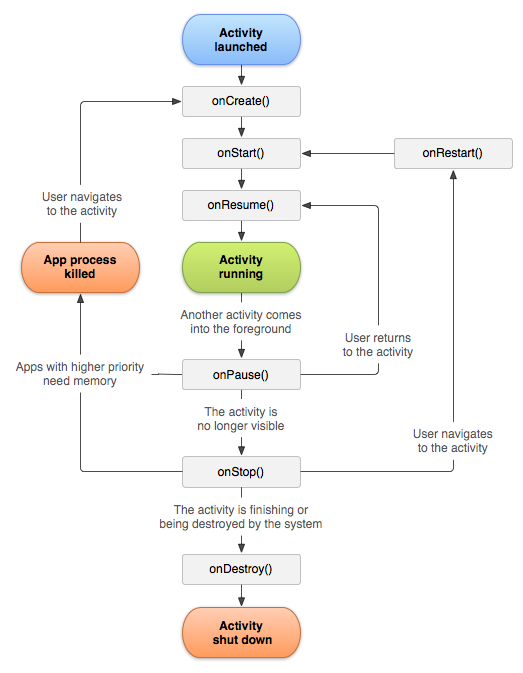
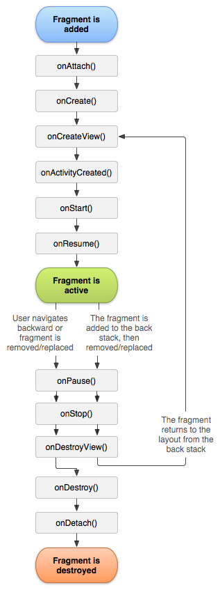

# Android XML UI

## Activity



OnCreate - onStart (onRestart) - onResume
OnPause - OnStop - onDestroy

- OnCreate: Activity Tạo lần đầu.
- OnStart: Activity hiển thị với User. xoay màn hình.
- OnResume: Gọi khi sau khi activity hiển thị lần nữa, sau khi ẩn đi bởi onPause.

- OnPause: Activity ẩn, nằm sau Activity khác (nhưng còn thấy, vd: ẩn sau FragmentDialog).
- OnStop: Activity ẩn hoàn toàn với user. không thấy nó nữa.
- OnDestroy: Activity bị giết bởi User hay Hệ thống.

### So sánh onCreate() và onStart()?

OnCreate: gọi khi Activity khởi tạo lần đầu, .
OnStart: gọi khi Activity hiển thị với người dùng..
.
Khi User quay lại Activity, gọi OnRestart > OnResume. .
Sau khi ứng dụng bị thu hồi bộ nhớ, gọi OnCreate lại.

### Cách gởi Data từ Activity B > A

1. Intent
put Extra to Inent, then start Activity with this Intent. 
   Intent intent = new Intent(ActA.this, ActB.class);
   intent.putExtra("key", sessionId);
   startActivity(intent);
ActivityB get 
   getIntent().getStringExtra("key").

2. Bundle
   Bundle b = new Bundle();
   b.putString("key", "value");
   indent.putExtra(b);

3. Use Static Medthod:
   String data = ActA.getData();

4. Shared Preferences
SharedPreferences sharedPref = getActivity().getPreferences(Context.MODE_PRIVATE);
SharedPreferences.Editor editor = sharedPref.edit();
editor.putInt(getString(R.string.saved_high_score_key), newHighScore);
editor.commit();

5. Database: SQLite, TextFile, ObjectFile

6. EventBus Third library, like: greenrobot EventBus

### Activity vs Fragment Activity vs AppCompatActivity

- Activity là lớp cơ sở
- Fragment Activity (extend Activity) có kèm quản lý fragment
- AppCompatActivity (extend FragmentActivity) có 1 số hàm tương thích Api Cũ

### Khi 1 activity đang chạy, ta nhấn nút Home thì activity đó đi vào những trạng thái nào

onPause -> onStop

### Khi 1 Activity đang chạy, ta chọn recent apps, quét qua để kill app đó thì activity đó đi vào những trạng thái nào

onPause -> onStop -> onDestroy

### Khi 1 Activity đang chạy mà bị crash, activity đó đi vào trạng thái nào

Crash ở Activity thì onDestroy.
Crash ở Application thì onStop.

### Khi đang ở trong Activity, xoay màn hình thì Activity đi vào những trạng thái nào

onStart -> onResume

### Khi đang ở trong Activity, mở 1 AlertDialog thì activity đi vào những trạng thái nào

Không có

### Tạo mới 1 Thread trong activity, khi mở activity mới thì Thread đó có còn chạy ko

Vẫn chạy kể cả khi finish Activity

### MediaPlayer đang chạy trong, tạo mới activity khác, player đó còn chạy ko

Vẫn chạy

### lúc nào onDestroy() được gọi mà không có onPause() và onStop()?

Khi finish() được gọi ở trong onCreate()

### tại sao chỉ nên gọi setContentView() trong onCreate()

onCreate: chỉ gọi một lần
onResume, onStart: gọi nhiều lần, tốn tài nguyên.

## Fragment

Fragment là một phần giao diện người dùng.
Hiển thị 1 phần trong Activity.
Có thể tái sử dụng nhiều lần hay 1 màn hình riêng biệt.
Có layout hành vi và vòng đời riêng.
VD: nội dung của tab, a Dialog, a list, a ui of slider...

### Trình bày LifeCycle của Fragment

onAttach. onCreate. onCreateView. onViewCreated.
onStart.
onResume.

onPause.
onStop.
onDestroyView. onDestroy. onDetach.



### phân biệt activity và fragment

🔹 Dùng Activity khi:
✅ Màn hình hoạt động độc lập.
✅ Cần xử lý riêng biệt, không phụ thuộc vào giao diện khác.
✅ Ít có sự thay đổi giữa các giao diện.

🔹 Dùng Fragment khi:
✅ Muốn tái sử dụng UI trong nhiều màn hình.
✅ Cần hiển thị nhiều thành phần UI trong một Activity.
✅ Giao diện có thể thay đổi động (như máy tính bảng, màn hình lớn).

### Nếu thêm nhiều Fragment vào cùng 1 FrameLayout bằng FragmentManager thì thực tế hiển thị fragment nào, các fragment kia rơi vào trạng thái gì

- Hiển thị tất cả chồng lên nhau.
- Không rơi vào trạng thái nào. Trạng thái cuối là onResume

### Giải thích Back stack fragment manager

Quản lý việc điều hướng giữa các Fragment trong ứng dụng Android.
Khi một Fragment được thêm vào Back Stack, nó sẽ được lưu lại để có thể quay lại (Back) sau này.

```java
// Thêm Fragment vào View(fragment_container)
// Hiện cả 2, không Pause Fragment cũ
MyFragment fragment = new MyFragment();
transaction.add(R.id.fragment_container, fragment, "fragment_tag");

// Xóa Fragment (destroy fragment)
transaction.remove(fragment);
// Thay thế Fagment hiện tại = fragment = remove + add (Pause fragment cũ)
transaction.replace(R.id.fragment_container, fragment, "fragment_tag");

// giống Remove, không đính kèm, còn lưu trạng thái (TAG)
transaction.detach(fragment);
// đính kèm Fragment bị Detach trở lại, (findFragmentByTag() != null)
transaction.attach(fragment);

```

### Constrain layout

Là Container View,
View con có mối quan hệ, ràng buộc với nhau và Parent View.
Tương tự như RelativeLayout, nhưng linh hoạt hơn.
Dễ sử dụng với Layout Editor của Android Studio.

### Fragment dialog

Hiện Fragment theo dạng Dialog, dialog phức tạp, tái sử dụng, khuyến khích dùng

### Khác nhau include và merge

Include hiển thị layout có Merge làm container

```xml
<LinearLayout><include></Linearlayout>

<merge>123...</merge> => <LinearLayout>123...</Linearlayout>

```

### So sánh LinearLayout và ConstrainLayout

* LinearLayout: các View con sắp theo 1 chiều (dọc, ngang).
* ConstrainLayout: các View con sắp xếp có liên kết với nhau và view cha.

### Sự khác nhau giữ View.GONE và View.INVISIBLE

* Gone: View biến mất, không giữ kích thước.
* Invisible: View biến mất, vẫn giữ kích thước.

### RecyclerView là gì

* Là một ViewGroup nâng cao.
* Để hiển thị danh sách hoặc lưới dữ liệu một cách hiệu quả trong Android.
* Nó là phiên bản cải tiến của ListView và GridView.
* Hiệu suất cao bằng cách tái sử dụng View và tối ưu bộ nhớ.

#### Viewholder là gì

Là một lớp trong RecyclerView.
Mô tả Item View và Dữ liệu trong RecyclerView..
Tối ưu hóa hiệu suất bằng cách tái sử dụng View, tránh việc gọi findViewById() nhiều lần, giúp cuộn danh sách mượt mà hơn.

#### làm recycler view giống view pager

SnapHelper Decoration

#### Thay đổi 1 Phần ViewHolder

onBindViewHolder payloads

#### RecylerView Kiểm tra 2 item không trùng

DiffUtil

## Giải thích về 4 launchmode: standard, singleTop, singleTask, singleInstance

* Standard: nhiều Activity tồn tại (khởi tạo nhiều lần).
* SingleTop: nhiều Activity tồn tại (khởi tạo nhiều lần). Nếu Activity đã khởi tạo ở trên cùng, chỉ gọi hàm onNewIntent. Nếu không trên cùng thì khởi tạo lại..
* SingleTask: Chỉ 1 Activity tồn tại. Nếu Activity đã khởi tạo, destroy các Activity sau nó..
* singleInstance: Chỉ 1 Activity tồn tại, Activity chạy Task khác. Nếu Activity đã khởi tạo, sẽ nhảy lên trên.
