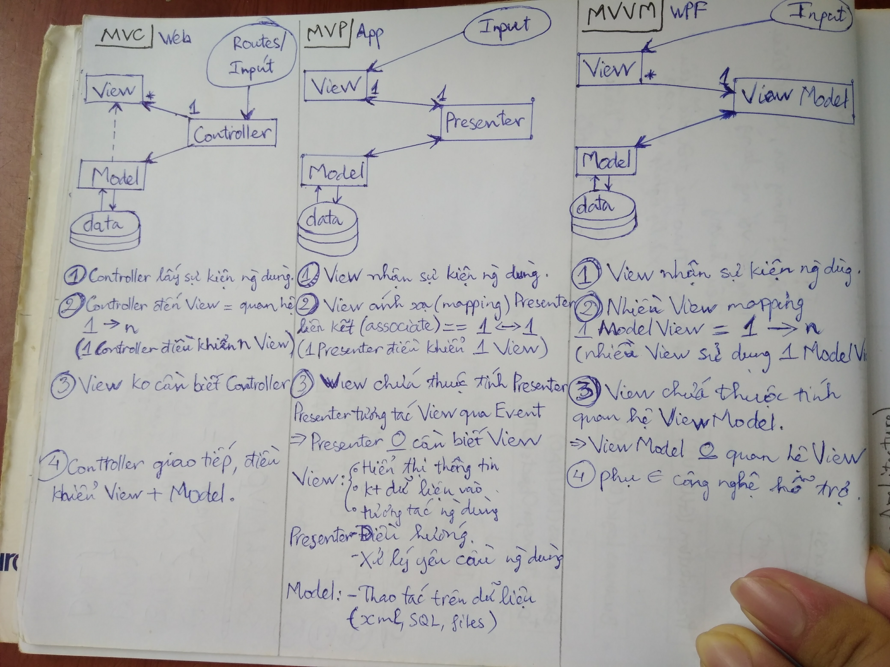
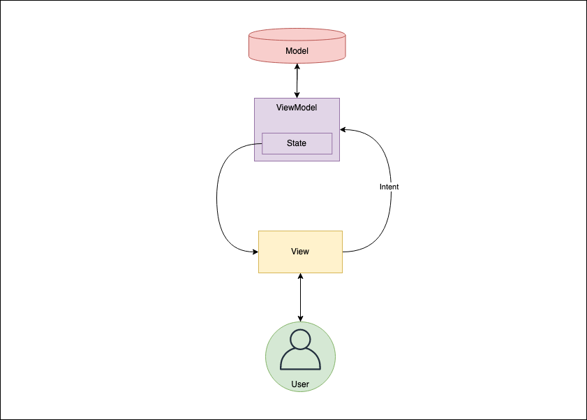

# Câu hỏi phỏng vấn Java - Kotlin

- [Câu hỏi phỏng vấn Java - Kotlin](#câu-hỏi-phỏng-vấn-java---kotlin)
  - [Liệt kê, giải thích 4 tính chất OOP](#liệt-kê-giải-thích-4-tính-chất-oop)
  - [S.O.L.I.D](#solid)
  - [Khi nào dùng Interface hoặc Abstract Class](#khi-nào-dùng-interface-hoặc-abstract-class)
  - [Java dùng pass-by-value hay pass-by-reference](#java-dùng-pass-by-value-hay-pass-by-reference)
  - [Daemon Thread là gì](#daemon-thread-là-gì)
  - [Sealed class, data class](#sealed-class-data-class)
  - [let, also, apply, with](#let-also-apply-with)
  - [val, var, const, const val, lazy, lateinit](#val-var-const-const-val-lazy-lateinit)
  - [Generic](#generic)
  - [Singletone](#singletone)
  - [Singleton dùng để làm gì](#singleton-dùng-để-làm-gì)
  - [Garbage collection hoạt động ntn](#garbage-collection-hoạt-động-ntn)
  - [Khi nào 1 object sẵn sàng for Garbage collection hốt](#khi-nào-1-object-sẵn-sàng-for-garbage-collection-hốt)
  - [Rx](#rx)
    - [Operator trong RxJava](#operator-trong-rxjava)
    - [CompositeDisposable](#compositedisposable)
    - [Map và FatMap](#map-và-fatmap)
    - [debounce, throttleFirst, throttleLatest](#debounce-throttlefirst-throttlelatest)
    - [Backpressure là gì](#backpressure-là-gì)
    - [- Observable, Flowable, Single, Maybe, và Completable](#--observable-flowable-single-maybe-và-completable)
    - [Các loại Schedulers](#các-loại-schedulers)
    - [RxJava thành Coroutine](#rxjava-thành-coroutine)
  - [Coroutines](#coroutines)
    - [Launch vs Async](#launch-vs-async)
    - [Structured Concurrency](#structured-concurrency)
    - [Dispatcher trong Coroutines](#dispatcher-trong-coroutines)
    - [suspend function](#suspend-function)
    - [bắt lỗi trong Coroutine](#bắt-lỗi-trong-coroutine)
    - [SupervisorJob và Job](#supervisorjob-và-job)
    - [chạy nhiều tác vụ](#chạy-nhiều-tác-vụ)
    - [Dùng Coroutines thay vì RxJava](#dùng-coroutines-thay-vì-rxjava)
  - [MVVM, MVP, MVC, MVI là gì, khi nào dùng cái nào](#mvvm-mvp-mvc-mvi-là-gì-khi-nào-dùng-cái-nào)
    - [MVC (Model View Control)](#mvc-model-view-control)
    - [MVP (Model View Presenter)](#mvp-model-view-presenter)
    - [MVVM (ModelView View Model)](#mvvm-modelview-view-model)
    - [MVI: (Model View Intent)](#mvi-model-view-intent)
  - [Design pattern MVC, MVP, MVVM, MVI](#design-pattern-mvc-mvp-mvvm-mvi)
    - [Khi nào ViewModel Huỷ (onCleared)](#khi-nào-viewmodel-huỷ-oncleared)
  - [Cách hoán đổi 2 số a và b mà ko cần tạo thêm biến thứ 3](#cách-hoán-đổi-2-số-a-và-b-mà-ko-cần-tạo-thêm-biến-thứ-3)
  - [Trình bày cách để break bên trong vòng lặp lòng nhau](#trình-bày-cách-để-break-bên-trong-vòng-lặp-lòng-nhau)
  - [Liệt kê những trường hợp mà finally ko đc gọi](#liệt-kê-những-trường-hợp-mà-finally-ko-đc-gọi)

## Liệt kê, giải thích 4 tính chất OOP

- 🎁Tính đóng gói (encapsulation)
  - Cho phép gom các lớp thành Pakage
  - Cho phép chỉnh sửa phạm vi truy cập của biến, phương thức
  - 👉Lợi ích: Ngăn thay đổi trực tiếp từ bên ngoài, giúp dễ bảo trì hơn.

- 👪Tính kế thừa (Inheritance)
  - Cho phép lớp con kế thừa các thành phần của Cha.
  - Cho phép xây dựng 1 lớp mới, dựa trên lớp đã có.
  - 👉Lợi ích: Giúp tái sử dụng code, giảm sự trùng lặp.
  
- 😋😋Tính đa hình (polymorphism)
  - Lớp con có thể Ghi Đè lại phương thức lớp cha.
  - Đối tượng có thể thay đổi kiểu (biến hình)
  - 👉Lợi ích: Linh hoạt, dễ mở rộng tính năng. Viết code tổng quát hơn

- 🗿Tính trừu tượng (abstraction)
  - bằng cách chỉ đưa ra các thuộc tính và phương thức cần thiết của đối tượng,
  - ẩn đi cách thức mà nó thực hiện.
  - 👉Lợi ích: Loại bỏ tính chất phức tạp của đối tượng. Giúp tập trung vào hành vi (behavior) thay vì cách nó được thực hiện.

## S.O.L.I.D

S — Single Responsibility Principle
O — Open Closed Principle
L — Liskov Substitution Principle
I — Interface Segregation Principle
D — Dependency Inversion Principle

S — 🎯Single Responsibility Principle (nhiệm vụ)
class chỉ thực hiện một nhiệm vụ, chức năng. Model, network, calculate...

O — 🚪Open/Closed Principle (thích nghi)
Class nên mở rộng được mà không cần sửa đổi code cũ. 
Dùng interace để thiết kế.

L — 👨‍👦Liskov Substitution Principle (thay thế)
Class con phải thay thế được class cha.
Nếu lớp cha không giải quyết được lớp con, thì tạo lớp cha lớn hơn, để cả 2 cùng kế thừa.

I — 🚧Interface Segregation Principle (phân tách interface)
Tách nhiều interface thực hiện, sẽ tốt hơn là 1 interface chứa nhiều function. Ko phải implement ko cần thiết

D — 🚫🛐Dependency Inversion Principle (đảo ngược phụ thuộc)
Hạn chế Phụ thuộc Module trong Module. Tránh khởi tạo Module trong Module

## Khi nào dùng Interface hoặc Abstract Class

- Abstract class: là một class cha cho tất cả các class có cùng bản chất.
- Interface: là một chức năng mà bạn có thể thêm và bất kì class nào.

## Java dùng pass-by-value hay pass-by-reference

- Pass-by-value: (trong != ngoài) thay đổi biến trong hàm => ngoài hàm sẽ không bị ảnh hưởng. Nó giống như bạn copy giá trị của biến vào biến khác rồi truyền vào hàm.
- Pass-by-reference: (trong == ngoài) là khi bạn thay đổi biến trong hàm => ngoài hàm bị ảnh hưởng. Nó giống như bạn truyền đúng địa chỉ của biến đó vào hàm.

```java
public static void changeStuff(int a, Test b, Test c, int[] d)
{
    a = a * 10;     // méo đổi
    b = new Test(); // méo đổi
    c.item = "changed"; // đổi //reference
    d[0] = 3;   // đổi //reference
}
```

## Daemon Thread là gì

là những luồng của java chạy song song với luồng của ứng dụng. (vd: Garbage collection)
Tự hủy cùng với ứng dụng.

- Immutable và mutable là gì
- Tại sao Class String trong Java lại immutable

- StringBuilder vs String
- StringBuilder vs StringBuffer

## Sealed class, data class

- Sealed class: là lớp trừu tượng (Abstract class - SubClass phải cùng file), mở rộng của Enum class (có thể sử dụng when)
- Data Class: Lớp lưu trữ dữ liệu, khi khởi tạo phải có Properties. giữ Tham trị (giữ giá trị - Pass by value). Class giữ tham chiếu (pass by reference)

## let, also, apply, with

- with: để gọi nhiều phương thức(method) cùng 1 đối tượng.
- let: để check null
  - là một hàm phạm vi (scoping function):
  - Sử dụng một biến trong một phạm vi cụ thể trong đoạn code.
- apply: để Trả về Object (giống return function)
  - extension function cho tất cả các loại Object.
- also: để trả về Object gọi nó (return this)
- run: kết hợp with & let

## val, var, const, const val, lazy, lateinit

- var: khai báo biến.
- val: Khai báo biến tĩnh. (Khởi tạo lúc chạy)
- const val: Khai báo biến tĩnh. (khởi tạo lúc biên dịch)
- lateinit: biến khởi tạo sau. (dùng cho var)
- lazy: biến khởi tạo sau. (dùng cho val). được cấp lần đầu sử dụng (lazy by {}, giống get nhưng chỉ lấy lần đầu sử dụng)

## Generic

Sử dụng một class hoặc một implement theo cách chung chung
Thường viết Extention, hoặc viết base class

## Singletone

Khởi tạo duy nhất 1 class
Nếu dùng thì gọi lại khởi tạo đó

## Singleton dùng để làm gì

- Một class chỉ có duy nhất một instance (khởi tạo)
- Cung cấp toàn cầu để truy cập tới instance đó
- Dùng khi ứng dụng chỉ cần duy 1 instance để quản lý (vd: Trình nghe nhạc, chỉ cần 1 Singleton Music) 

## Garbage collection hoạt động ntn

Khi object không sử dụng => Garbage Collector đánh dấu

Khi có Garbage Collector, chúng ta có thể cấp phát bộ nhớ cho một đối tượng sau đó sử dụng nó và khi không còn bất kì một tham chiếu nào tới đối tượng đó, đối tượng sẽ được đánh dấu để Garbage Collector giải phóng các bộ nhớ đã được phân bổ. Và Garbage collector cũng đảm bảo rằng mọi đối tượng có tham chiếu trực tiếp sẽ không bị xóa khỏi bộ nhớ.

## Khi nào 1 object sẵn sàng for Garbage collection hốt

- Object không còn được sử dụng, hay tham chiếu

## Rx

- Xử lý bất đồng bộ gọn gàng hơn so với AsyncTask hoặc Handler.
- Hỗ trợ chaining (kết hợp nhiều tác vụ bất đồng bộ một cách dễ dàng).
- Hỗ trợ quản lý luồng dữ liệu với các Schedulers giúp xử lý đa luồng hiệu quả.
- Giảm callback hell khi sử dụng LiveData hoặc Callbacks.

### Operator trong RxJava

là các phương thức giúp biến đổi, kết hợp, lọc dữ liệu. Một số operator quan trọng:

- Transformation: map(), flatMap(), switchMap(), concatMap().
- Filtering: filter(), debounce(), distinct(), take(), skip().
- Combining: merge(), concat(), zip(), combineLatest().
- Error handling: onErrorReturn(), onErrorResumeNext(), retry().

### CompositeDisposable

giúp quản lý nhiều Disposable để tránh memory leaks.

### Map và FatMap

- map: Trả về phần tử độc lập
- fatMap: Trả về các phần tử đồng thời

### debounce, throttleFirst, throttleLatest

- debounce()	Chỉ nhận giá trị cuối cùng sau một khoảng thời gian không có dữ liệu mới. Ứng dụng: Text tìm kiếm
- throttleFirst()	Chỉ lấy giá trị đầu tiên trong mỗi khoảng thời gian cố định. Xử lý khi bấm button (tránh double click).
- throttleLatest()	Lấy giá trị mới nhất trong khoảng thời gian cố định.

### Backpressure là gì

- Backpressure xảy ra khi Observable phát ra dữ liệu quá nhanh so với khả năng xử lý của Observer, dẫn đến OutOfMemoryException.
- Cách giải quyết:
  - Dùng Flowable thay vì Observable.
  - Sử dụng các Backpressure Strategies như BUFFER, DROP, LATEST.

```kotlin
Flowable.create({ emitter ->
    for (i in 1..1000000) {
        emitter.onNext(i) // Phát ra dữ liệu rất nhanh
    }
}, BackpressureStrategy.DROP)  // Bỏ bớt dữ liệu nếu Observer không kịp xử lý
.subscribe { println(it) }
```

### - Observable, Flowable, Single, Maybe, và Completable

- Observable:	Phát ra nhiều giá trị hoặc không có gì.
- Flowable:	Giống - Observable, hỗ trợ Backpressure.
- Single:	Chỉ phát ra một giá trị duy nhất, hoặc lỗi.
- May: thể phát ra một giá trị, hoặc không có gì.
- Completable:	Chỉ thực hiện một hành động, mà không phát ra giá trị nào.

### Các loại Schedulers

- Schedulers.io() → Xử lý tác vụ I/O (API call, đọc/ghi database, đọc file).
- AndroidSchedulers.mainThread() → Chạy trên UI thread, dùng để cập nhật giao diện.
- Schedulers.single() → Chạy trên một thread duy nhất (tốt cho các tác vụ tuần tự).
- Schedulers.newThread() → Luôn tạo một thread mới cho mỗi tác vụ.
- Schedulers.computation() → Xử lý tác vụ tính toán (tính toán phức tạp, xử lý ảnh).

### RxJava thành Coroutine

Sử dụng suspendCoroutine hoặc rxSingle

```kotlin
suspend fun getUserData(): User {
    return rxSingle { apiService.getUser() }.await()
}
```

## Coroutines

- Coroutines giúp xử lý bất đồng bộ nhẹ hơn và dễ đọc hơn so với Thread
- Không cần tạo một Thread mới cho mỗi tác vụ
- Structured Concurrency → Dễ quản lý vòng đời, tránh memory leak.

### Launch vs Async

- launch - bất đồng bộ, Không có giá trị trả về
- async - bất đồng bộ, Có giá trị trả về
- runBlocking - đồng bộ, block thread chính

```kotlin
// launch - Không có giá trị trả về
val job = GlobalScope.launch {
    delay(1000)
    println("Launch done")
}

// async - Có giá trị trả về
val deferred = GlobalScope.async {
    delay(1000)
    "Async result"
}
println(deferred.await()) // Lấy kết quả từ async
```

### Structured Concurrency 

giúp đảm bảo rằng tất cả các coroutines con sẽ bị hủy khi coroutine cha bị hủy, giúp tránh memory leaks và dangling coroutines

```kotlin
class MyViewModel : ViewModel() {
    private val viewModelScope = CoroutineScope(Dispatchers.Main)

    fun fetchData() {
        viewModelScope.launch {
            val data = fetchFromNetwork()
            println(data)
        }
    }
    
    override fun onCleared() {
        super.onCleared()
        viewModelScope.cancel()  // Hủy tất cả coroutines khi ViewModel bị hủy
    }
}
```

### Dispatcher trong Coroutines

Dispatchers.Main:	Chạy trên UI thread -	Cập nhật UI
Dispatchers.IO:	Chạy trên I/O thread -	Gọi API, đọc/ghi database
Dispatchers.Default:	Dành cho tác vụ nặng (CPU-bound) -	Xử lý dữ liệu lớn, mã hóa
Dispatchers.Unconfined:	Chạy trên thread hiện tại -	Không khuyến khích sử dụng

```kotlin
CoroutineScope(Dispatchers.IO).launch {
    val result = fetchData()
    withContext(Dispatchers.Main) { updateUI(result) }
}
```

### suspend function

Hàm chỉ được gọi trong CoroutineScope

```kotlin
suspend fun fetchData(): String {
    delay(1000)  // Giả lập API call
    return "Data loaded"
}

// Gọi từ Coroutine
CoroutineScope(Dispatchers.IO).launch {
    val data = fetchData()
    println(data)
}
```

### bắt lỗi trong Coroutine

Sử dụng try-catch hoặc CoroutineExceptionHandler

```kotlin
CoroutineScope(Dispatchers.IO).launch {
    try {
        val data = fetchData()
        println(data)
    } catch (e: Exception) {
        println("Error: ${e.message}")
    }
}
```

### SupervisorJob và Job

- Job: Nếu một coroutine con lỗi, toàn bộ coroutine cha bị hủy.	
- SupervisorJob: Nếu một coroutine con lỗi, các coroutine khác vẫn tiếp tục chạy.

```kotlin
val scope = CoroutineScope(SupervisorJob() + Dispatchers.Main)

scope.launch {
    throw RuntimeException("This will not cancel other coroutines")
}

scope.launch {
    delay(1000)
    println("This still runs")
}
```

### chạy nhiều tác vụ

async

```kotlin
suspend fun loadData() {
    coroutineScope {
        val apiCall = async { fetchFromNetwork() }
        val dbCall = async { fetchFromDatabase() }
        println("Result: ${apiCall.await()} + ${dbCall.await()}")
    }
}
```

### Dùng Coroutines thay vì RxJava

- Coroutines: được Android Studio hỗ trợ
- Cú pháp đơn giản
- Ít tốn tài nguyên hệ thống
- Hiệu suất tốt hơn

## MVVM, MVP, MVC, MVI là gì, khi nào dùng cái nào

MVC: 1 Controler xử lý nhiều View
MVP: 1 Presenter xử lý 1 View, View giao tiếp trực tiếp vào Presenter
MVVM: 1 View Model xử lý 1 View, View giao tiếp ViewModel thông qua giao thức hỗ trợ
MVI: View giao tiếp ViewModel thông qua Intent và nhận State trả về

### MVC (Model View Control)

Controller get Event from User
1 Controller relate, control to multi View
Controller control View + Model

### MVP (Model View Presenter)

### MVVM (ModelView View Model)

View: interactive with user, show infomation, gét user input.
Model: handle with data, sqlite, file
3 Layer.
ViêwModel: connect View& ViewModel, handle demand from view.

View get Event from User
Multiple View mapping 1 ModelView
View contain relation properties to ViewModel
belong support technology, Need a libary to use

### MVI: (Model View Intent)

- View -> Intent -> ViewModel -> State -> View
- 
- 

## Design pattern MVC, MVP, MVVM, MVI


MVC: Model View Controller
Controller tương tác trực tiếp View

MVP: Model View Presenter
Presenter tương tác View qua Interface (Event), Model
Presenter tách biệt hoàn toàn View

MVVM: Model View ViewModel
Phụ thuộc công nghệ hỗ trợ
ViewModel không quan hệ, tách biệt View
View chứa thuộc tính quan hệ ViewModel

MVI: Model View Intent
Intent Ý định, hành động của User, hay ứng dụng
Presenter hay ViewModel tương tác View qua Intent

View: Hiển thị thông tin, tương Tác với User, lấy User Input
Model: mô tả thông tin, chứa dữ liệu
Controller, Presenter, ViewModel, Xử lý yêu cầu gởi đến, gởi trả thông tin về View hiển thị

**English**

MVVM: design pattern.
View: interactive with user, show infomation, gét user input.
Model: handle with data, sqlite, file
3 Layer.
ViêwModel: connect View& ViewModel, handle demand from view.

View get Event from User
Multiple View mapping 1 ModelView
View contain relation properties to ViewModel
belong support technology, Need a libary to use

MVC:
Controller get Event from User
1 Controller relate, control to multi View
Controller control View + Model
Longger code

### Khi nào ViewModel Huỷ (onCleared)

Activity hoặc Fragment Destroy

## Cách hoán đổi 2 số a và b mà ko cần tạo thêm biến thứ 3

- Dùng cộng trừ

```java
a = a + b;
b = a - b;
a = a - b;
```

- Dùng Nhân chia

```java
a = a * b;
b = a / b;
a = a / b;
```

## Trình bày cách để break bên trong vòng lặp lòng nhau

```java
for(int i = 0; i < 1000; i++) {
   for(int j = 0; j < 1000; j++) {
       if(condition) {
            // both of the loops need to break and control will go to stmt2
            i = j = 1000; break;
       }
   }
}

// Dùng goto:
for(int i = 0; i < 1000; i++) {
    for(int j = 0; j < 1000; i++) {
        if (condition) {
            goto end;
        }
    }
}

end:
stmt2
```

## Liệt kê những trường hợp mà finally ko đc gọi

- Finally: biến không thay đổi giá trị sau khi khởi tạo
