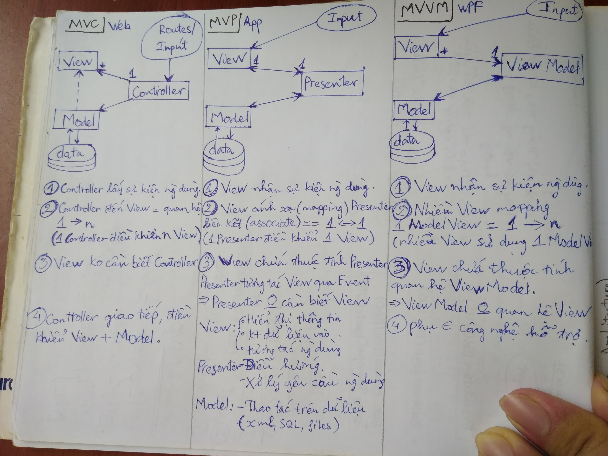
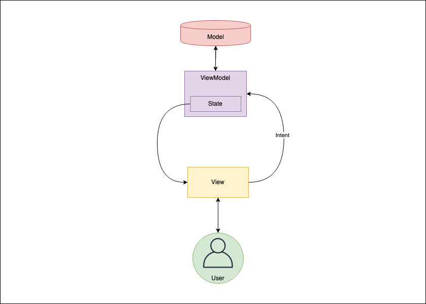

# Câu hỏi phỏng vấn Java - Kotlin

- [Câu hỏi phỏng vấn Java - Kotlin](#câu-hỏi-phỏng-vấn-java---kotlin)
  - [Liệt kê, giải thích 4 tính chất OOP](#liệt-kê-giải-thích-4-tính-chất-oop)
  - [S.O.L.I.D](#solid)
  - [Khi nào dùng Interface hoặc Abstract Class](#khi-nào-dùng-interface-hoặc-abstract-class)
  - [Java dùng pass-by-value hay pass-by-reference](#java-dùng-pass-by-value-hay-pass-by-reference)
  - [Daemon Thread là gì](#daemon-thread-là-gì)
  - [Sealed class, data class](#sealed-class-data-class)
  - [let, also, apply, with](#let-also-apply-with)
  - [val, var, const, const val, lazy, lateinit](#val-var-const-const-val-lazy-lateinit)
  - [Generic](#generic)
  - [Singletone](#singletone)
  - [Singleton dùng để làm gì](#singleton-dùng-để-làm-gì)
  - [Garbage collection hoạt động ntn](#garbage-collection-hoạt-động-ntn)
  - [Khi nào 1 object sẵn sàng for Garbage collection hốt](#khi-nào-1-object-sẵn-sàng-for-garbage-collection-hốt)
  - [Rx](#rx)
    - [Operator trong RxJava](#operator-trong-rxjava)
    - [CompositeDisposable](#compositedisposable)
    - [Map và FatMap](#map-và-fatmap)
    - [debounce, throttleFirst, throttleLatest](#debounce-throttlefirst-throttlelatest)
    - [Backpressure là gì](#backpressure-là-gì)
    - [- Observable, Flowable, Single, Maybe, và Completable](#--observable-flowable-single-maybe-và-completable)
    - [Các loại Schedulers](#các-loại-schedulers)
    - [RxJava thành Coroutine](#rxjava-thành-coroutine)
  - [Coroutines](#coroutines)
    - [Launch vs Async](#launch-vs-async)
    - [Structured Concurrency](#structured-concurrency)
    - [Dispatcher trong Coroutines](#dispatcher-trong-coroutines)
    - [suspend function](#suspend-function)
    - [bắt lỗi trong Coroutine](#bắt-lỗi-trong-coroutine)
    - [SupervisorJob và Job](#supervisorjob-và-job)
    - [chạy nhiều tác vụ](#chạy-nhiều-tác-vụ)
    - [Dùng Coroutines thay vì RxJava](#dùng-coroutines-thay-vì-rxjava)
  - [MVVM, MVP, MVC, MVI là gì, khi nào dùng cái nào](#mvvm-mvp-mvc-mvi-là-gì-khi-nào-dùng-cái-nào)
    - [MVC (Model View Control)](#mvc-model-view-control)
    - [MVP (Model View Presenter)](#mvp-model-view-presenter)
    - [MVVM (ModelView View Model)](#mvvm-modelview-view-model)
    - [MVI: (Model View Intent)](#mvi-model-view-intent)
  - [Design pattern MVC, MVP, MVVM, MVI](#design-pattern-mvc-mvp-mvvm-mvi)
    - [Khi nào ViewModel Huỷ (onCleared)](#khi-nào-viewmodel-huỷ-oncleared)
  - [Cách hoán đổi 2 số a và b mà ko cần tạo thêm biến thứ 3](#cách-hoán-đổi-2-số-a-và-b-mà-ko-cần-tạo-thêm-biến-thứ-3)
  - [Trình bày cách để break bên trong vòng lặp lòng nhau](#trình-bày-cách-để-break-bên-trong-vòng-lặp-lòng-nhau)
  - [Liệt kê những trường hợp mà finally ko đc gọi](#liệt-kê-những-trường-hợp-mà-finally-ko-đc-gọi)

## Liệt kê, giải thích 4 tính chất OOP

- 🎁Tính đóng gói (encapsulation)
  - Cho phép gom các lớp thành Pakage
  - Cho phép chỉnh sửa phạm vi truy cập của biến, phương thức
  - 👉Lợi ích: Ngăn thay đổi trực tiếp từ bên ngoài, giúp dễ bảo trì hơn.

- 👪Tính kế thừa (Inheritance)
  - Cho phép lớp con kế thừa các thành phần của Cha.
  - Cho phép xây dựng 1 lớp mới, dựa trên lớp đã có.
  - 👉Lợi ích: Giúp tái sử dụng code, giảm sự trùng lặp.
  
- 😋😋Tính đa hình (polymorphism)
  - Lớp con có thể Ghi Đè lại phương thức lớp cha.
  - Đối tượng có thể thay đổi kiểu (biến hình)
  - 👉Lợi ích: Linh hoạt, dễ mở rộng tính năng. Viết code tổng quát hơn

- 🗿Tính trừu tượng (abstraction)
  - bằng cách chỉ đưa ra các thuộc tính và phương thức cần thiết của đối tượng,
  - ẩn đi cách thức mà nó thực hiện.
  - 👉Lợi ích: Loại bỏ tính chất phức tạp của đối tượng. Giúp tập trung vào hành vi (behavior) thay vì cách nó được thực hiện.

## S.O.L.I.D

là 5 nguyên tắc thiết kế hướng đối tượng (OOP) giúp mã nguồn dễ hiểu, dễ bảo trì và mở rộng

Single (Một việc), Open (Mở rộng/Đóng sửa), Liskov (Thay thế), Interface (Chia nhỏ), và Dependency (Phụ thuộc trừu tượng)

S — Single Responsibility Principle.
O — Open Closed Principle.
L — Liskov Substitution Principle.
I — Interface Segregation Principle.
D — Dependency Inversion Principle.
.
S — 🎯Single Responsibility Principle (nhiệm vụ).
class chỉ thực hiện một nhiệm vụ, chức năng. Model, network, calculate....
.
O — 🚪Open/Closed Principle (thích nghi).
Class nên mở rộng được mà không cần sửa đổi code cũ. .
Dùng interace để thiết kế..
.
L — 👨‍👦Liskov Substitution Principle (thay thế).
Nếu Class con thay thế được class cha thì ứng dụng vẫn hoạt động đúng,
.
I — 🚧🚧Interface Segregation Principle (phân tách interface).
Tách nhiều interface thực hiện, sẽ tốt hơn là 1 interface chứa nhiều function. Ko phải implement ko cần thiết.
.
D — 🚫🛐Dependency Inversion Principle (đảo ngược phụ thuộc).
Hạn chế Phụ thuộc Module trong Module. Tránh khởi tạo Module trong Module

## Dependency injection là gì

- Là phương pháp giảm sự phụ thuộc 1 module trong 1 module.
- Thay vì khởi tạo 1 object trong 1 object, ta khởi tạo nó bên ngoài. Rồi tim vào bên trong qua: constructer, setter, interface...

## Khi nào dùng Interface hoặc Abstract Class

- Abstract class: là một class cha cho tất cả các class có cùng bản chất..
- Interface: là một chức năng mà bạn có thể thêm và bất kì class nào.

## Java dùng pass-by-value hay pass-by-reference

pass-by-value (truyền tham trị). 
Khi truyền một đối tượng, Java sao chép giá trị của tham chiếu (địa chỉ bộ nhớ) và truyền bản sao đó vào phương thức. 
Vì vậy, bạn có thể thay đổi dữ liệu bên trong đối tượng gốc, nhưng không thể làm cho biến tham chiếu gốc trỏ tới một đối tượng mới.

```java
public static void changeStuff(int a, Test b, Test c, int[] d)
{
    a = a * 10;     // méo đổi
    b = new Test(); // méo đổi
    c.item = "changed"; // đổi //reference
    d[0] = 3;   // đổi //reference
}
```

## Daemon Thread là gì

là những luồng của java chạy song song với luồng của ứng dụng. (vd: Garbage collection)
Tự hủy cùng với ứng dụng.

## Immutable và mutable là gì

- Mutable var: biến thay đổi giá trị sau khi khởi tạo.
- Immutable val: biến không thể thay đổi giá trị.

## String và StringBuilder vs StringBuffer

- String là lớp cơ sở để xử lý chuỗi
- StringBuilder, StringBuffer hiệu xuất cao hơn.

## Các lớp trong Kotlin

- Sealed class: là lớp trừu tượng.
mở rộng của Enum class (có thể sử dụng when).

- Data Class: Lớp lưu trữ dữ liệu.
khi khởi tạo phải có Properties.

KOTLIN CLASSES
│
├── [ Lớp chứa dữ liệu ]
│   └── ➔ DATA CLASS (có sẵn equals/copy. Dùng để Lưu trữ Model)
│
├── [ Lớp quản lý trạng thái ]
│   ├── ➔ ENUM CLASS (Tập hợp hằng số cố định: RED, BLUE, GREEN)
│   └── ➔ SEALED CLASS (Mở rộng của ENUM, Có thể thêm hàm: Success(data), Error(msg))
│
├── [ Lớp cấu trúc & Kế thừa ]
│   ├── ➔ ABSTRACT CLASS (Lớp trừu tượng, làm nền tảng cho lớp con)
│   ├── ➔ OPEN CLASS (Lớp cho phép kế thừa)
│   └── ➔ INTERFACE (Định nghĩa hành vi/khả năng cho các lớp khác)
│
├── [ Lớp đặc biệt (Single Instance) ]
│   └── ➔ OBJECT (Singleton - Duy nhất một đối tượng toàn ứng dụng. Dùng để tạo Singleton, Utility class)
│
└── [ Lớp lồng nhau ]
    ├── ➔ NESTED CLASS (Lớp nằm trong lớp khác, không truy cập được lớp cha)
    └── ➔ INNER CLASS (Có từ khóa 'inner', truy cập được mọi thứ của lớp cha)

## các scope function trong kotlin

Là các hàm phạm vi (Scope Function).
giúp viết code gọn gàng hơn bằng cách giới hạn phạm vi (scope) của một object trong một khối (block).

- Let: biến đổi object, hoặc kiểm tra null. trả về object mới. It
- apply: để đặt properties khi khởi tạo object. Trả về object mới. This
- run: thực hiện nhiều thao tác liên quan object. trả về object mới. This
- with: thực hiện nhiều thao tác liên quan object. Trả về object cũ. This
- also: dùng khi muốn làm gì object, như logging, debug. Trả về object cũ. It

+----------+------------+-------------------+------------------------------------------+

|   HÀM    | THAM CHIẾU |     TRẢ VỀ        |           CÁCH DÙNG PHỔ BIẾN             |
+----------+------------+-------------------+------------------------------------------+

|   let    |     it     | Kết quả Lambda    | Kiểm tra Null (?.let), biến đổi dữ liệu  |
+----------+------------+-------------------+------------------------------------------+

|   run    |    this    | Kết quả Lambda    | Cấu hình đối tượng và tính toán kết quả  |
+----------+------------+-------------------+------------------------------------------+

|   with   |    this    | Kết quả Lambda    | Nhóm nhiều hàm gọi trên một đối tượng    |
+----------+------------+-------------------+------------------------------------------+

|   apply  |    this    | Object ban đầu    | Khởi tạo, cấu hình thuộc tính đối tượng  |
+----------+------------+-------------------+------------------------------------------+

|   also   |     it     | Object ban đầu    | Các thao tác phụ (logging, debug...)     |
+----------+------------+-------------------+------------------------------------------+


```kotlin
/// let
val number = "123"
val result = number.let { it.toInt() * 2 }
println(result) // 246

/// run
val message = "Hello Kotlin".run {
  println(length) // In ra 13
  uppercase() // Trả về "HELLO KOTLIN"
}
println(message) // HELLO KOTLIN

/// with
val person = Person("John", 25)
with(person) {
  println(name) // John
  println(age) // 25
}

/// Apply
val person = Person().apply {
  name = "Alice"
  age = 30
}
println(person.name) // Alice

/// also
val numbers = mutableListOf(1, 2, 3).also {
  println("Danh sách ban đầu: $it")
}
```

## val, var, const, const val, lazy, lateinit

- var: khai báo biến..
- val: Khai báo biến tĩnh. (Khởi tạo lúc chạy).
- const val: Khai báo biến tĩnh. (khởi tạo lúc biên dịch).
- lateinit var: biến khởi tạo sau.
- lazy val: biến khởi tạo sau. được cấp lần đầu sử dụng (lazy by {}, giống get nhưng chỉ lấy lần đầu sử dụng)

## Generic

Là tính năng giúp tái sử dụng code với nhiều kiểu dữ liệu khác nhau

## Singletone

Khởi tạo duy nhất 1 object trong ứng dụng.
Nếu dùng thì gọi lại object đó

## Singleton dùng để làm gì

- Một class chỉ có duy nhất một khởi tạo (instance).
- Dùng khi ứng dụng chỉ cần duy 1 khởi tạo.
- Để quản lý (vd: Trình nghe nhạc, chỉ cần 1 Singleton Music)

## Garbage collection hoạt động ntn

Khi object không sử dụng, thì Garbage Collector đánh dấu.

khi không còn bất kì một tham chiếu nào tới đối tượng đó, Garbage Collector giải phóng các bộ nhớ đã được phân bổ.

## Khi nào 1 object sẵn sàng for Garbage collection hốt

Object không còn được sử dụng, và được tham chiếu

## Rx

- Xử lý bất đồng bộ gọn gàng hơn so với AsyncTask hoặc Handler.
- Hỗ trợ chaining (kết hợp nhiều tác vụ bất đồng bộ một cách dễ dàng).
- Hỗ trợ quản lý luồng dữ liệu với các Schedulers giúp xử lý đa luồng hiệu quả.
- Giảm callback hell khi sử dụng LiveData hoặc Callbacks.

### Operator trong RxJava

là các phương thức giúp biến đổi, kết hợp, lọc dữ liệu. Một số operator quan trọng:

- Transformation: map(), flatMap(), switchMap(), concatMap().
- Filtering: filter(), debounce(), distinct(), take(), skip().
- Combining: merge(), concat(), zip(), combineLatest().
- Error handling: onErrorReturn(), onErrorResumeNext(), retry().

### CompositeDisposable

giúp quản lý nhiều Disposable để tránh memory leaks.

### Map và FatMap

- map: Trả về phần tử độc lập
- fatMap: Trả về các phần tử đồng thời

### debounce, throttleFirst, throttleLatest

- debounce()	Chỉ nhận giá trị cuối cùng sau một khoảng thời gian không có dữ liệu mới. Ứng dụng: Text tìm kiếm
- throttleFirst()	Chỉ lấy giá trị đầu tiên trong mỗi khoảng thời gian cố định. Xử lý khi bấm button (tránh double click).
- throttleLatest()	Lấy giá trị mới nhất trong khoảng thời gian cố định.

### Backpressure là gì

- Backpressure xảy ra khi Observable phát ra dữ liệu quá nhanh so với khả năng xử lý của Observer, dẫn đến OutOfMemoryException.
- Cách giải quyết:
  - Dùng Flowable thay vì Observable.
  - Sử dụng các Backpressure Strategies như BUFFER, DROP, LATEST.

```kotlin
Flowable.create({ emitter ->
    for (i in 1..1000000) {
        emitter.onNext(i) // Phát ra dữ liệu rất nhanh
    }
}, BackpressureStrategy.DROP)  // Bỏ bớt dữ liệu nếu Observer không kịp xử lý
.subscribe { println(it) }
```

### - Observable, Flowable, Single, Maybe, và Completable

- Observable:	Phát ra nhiều giá trị hoặc không có gì.
- Flowable:	Giống - Observable, hỗ trợ Backpressure.
- Single:	Chỉ phát ra một giá trị duy nhất, hoặc lỗi.
- May: thể phát ra một giá trị, hoặc không có gì.
- Completable:	Chỉ thực hiện một hành động, mà không phát ra giá trị nào.

### Các loại Schedulers

- Schedulers.io() → Xử lý tác vụ I/O (API call, đọc/ghi database, đọc file).
- AndroidSchedulers.mainThread() → Chạy trên UI thread, dùng để cập nhật giao diện.
- Schedulers.single() → Chạy trên một thread duy nhất (tốt cho các tác vụ tuần tự).
- Schedulers.newThread() → Luôn tạo một thread mới cho mỗi tác vụ.
- Schedulers.computation() → Xử lý tác vụ tính toán (tính toán phức tạp, xử lý ảnh).

### RxJava thành Coroutine

Sử dụng suspendCoroutine hoặc rxSingle

```kotlin
suspend fun getUserData(): User {
    return rxSingle { apiService.getUser() }.await()
}
```

## Coroutines

- Coroutines giúp xử lý bất đồng bộ nhẹ hơn và dễ đọc hơn so với Thread.
- Không cần tạo một Thread mới cho mỗi tác vụ.
- Structured Concurrency → Dễ quản lý vòng đời, tránh memory leak.

### Launch vs Async

- launch - bất đồng bộ, Không có giá trị trả về.
- async - bất đồng bộ, Có giá trị trả về.
- runBlocking - đồng bộ, block thread chính.

```kotlin
// launch - Không có giá trị trả về
val job = GlobalScope.launch {
    delay(1000)
    println("Launch done")
}

// async - Có giá trị trả về
val deferred = GlobalScope.async {
    delay(1000)
    "Async result"
}
println(deferred.await()) // Lấy kết quả từ async
```

### Structured Concurrency 

giúp đảm bảo rằng tất cả các coroutines con sẽ bị hủy khi coroutine cha bị hủy, giúp tránh memory leaks và dangling coroutines

```kotlin
class MyViewModel : ViewModel() {
    private val viewModelScope = CoroutineScope(Dispatchers.Main)

    fun fetchData() {
        viewModelScope.launch {
            val data = fetchFromNetwork()
            println(data)
        }
    }
    
    override fun onCleared() {
        super.onCleared()
        viewModelScope.cancel()  // Hủy tất cả coroutines khi ViewModel bị hủy
    }
}
```

### Dispatcher trong Coroutines

Dispatchers.Main:	Chạy trên UI thread -	Cập nhật UI
Dispatchers.IO:	Chạy trên I/O thread -	Gọi API, đọc/ghi database
Dispatchers.Default:	Dành cho tác vụ nặng (CPU-bound) -	Xử lý dữ liệu lớn, mã hóa
Dispatchers.Unconfined:	Chạy trên thread hiện tại -	Không khuyến khích sử dụng

```kotlin
CoroutineScope(Dispatchers.IO).launch {
    val result = fetchData()
    withContext(Dispatchers.Main) { updateUI(result) }
}
```

### suspend function

Hàm chỉ được gọi trong CoroutineScope

```kotlin
suspend fun fetchData(): String {
    delay(1000)  // Giả lập API call
    return "Data loaded"
}

// Gọi từ Coroutine
CoroutineScope(Dispatchers.IO).launch {
    val data = fetchData()
    println(data)
}
```

### bắt lỗi trong Coroutine

Sử dụng try-catch hoặc CoroutineExceptionHandler

```kotlin
CoroutineScope(Dispatchers.IO).launch {
    try {
        val data = fetchData()
        println(data)
    } catch (e: Exception) {
        println("Error: ${e.message}")
    }
}
```

### SupervisorJob và Job

- Job: Nếu một coroutine con lỗi, toàn bộ coroutine cha bị hủy.	
- SupervisorJob: Nếu một coroutine con lỗi, các coroutine khác vẫn tiếp tục chạy.

```kotlin
val scope = CoroutineScope(SupervisorJob() + Dispatchers.Main)

scope.launch {
    throw RuntimeException("This will not cancel other coroutines")
}

scope.launch {
    delay(1000)
    println("This still runs")
}
```

### chạy nhiều tác vụ

async

```kotlin
suspend fun loadData() {
    coroutineScope {
        val apiCall = async { fetchFromNetwork() }
        val dbCall = async { fetchFromDatabase() }
        println("Result: ${apiCall.await()} + ${dbCall.await()}")
    }
}
```

### Dùng Coroutines thay vì RxJava

- Coroutines: được Android Studio hỗ trợ
- Cú pháp đơn giản
- Ít tốn tài nguyên hệ thống
- Hiệu suất tốt hơn

## MVVM, MVP, MVC, MVI là gì, khi nào dùng cái nào

MVC: 1 Controler xử lý nhiều View
MVP: 1 Presenter xử lý 1 View, View giao tiếp trực tiếp vào Presenter
MVVM: 1 View Model xử lý 1 View, View giao tiếp ViewModel thông qua giao thức hỗ trợ
MVI: View giao tiếp ViewModel thông qua Intent và nhận State trả về

### MVC (Model View Control)

Controller get Event from User
1 Controller relate, control to multi View
Controller control View + Model

### MVP (Model View Presenter)

### MVVM (Model-View ViewModel)

Là kiến trúc phần mềm giúp tổ chức code trong ứng dụng Android một cách gọn gàng, dễ bảo trì và dễ kiểm thử.

1️⃣ View (Activity/Fragment) gửi yêu cầu lấy dữ liệu.
2️⃣ ViewModel xử lý yêu cầu, gọi Model (API, Database) để lấy dữ liệu.
3️⃣ Model trả dữ liệu về ViewModel.
4️⃣ ViewModel cập nhật dữ liệu lên View bằng LiveData hoặc StateFlow.
5️⃣ View hiển thị dữ liệu lên UI.

View → ViewModel → Model (Lấy dữ liệu)
Model → ViewModel → View (Cập nhật UI)

### MVI: (Model View Intent)

- View -> Intent -> ViewModel -> State -> View
- 
- 

## Design pattern MVC, MVP, MVVM, MVI


MVC: Model View Controller
Controller tương tác trực tiếp View

MVP: Model View Presenter
Presenter tương tác View qua Interface (Event), Model
Presenter tách biệt hoàn toàn View

MVVM: Model View ViewModel
Phụ thuộc công nghệ hỗ trợ
ViewModel không quan hệ, tách biệt View
View chứa thuộc tính quan hệ ViewModel

MVI: Model View Intent
Intent Ý định, hành động của User, hay ứng dụng
Presenter hay ViewModel tương tác View qua Intent

View: Hiển thị thông tin, tương Tác với User, lấy User Input
Model: mô tả thông tin, chứa dữ liệu
Controller, Presenter, ViewModel, Xử lý yêu cầu gởi đến, gởi trả thông tin về View hiển thị

**English**

MVVM: design pattern.
View: interactive with user, show infomation, gét user input.
Model: handle with data, sqlite, file
3 Layer.
ViêwModel: connect View& ViewModel, handle demand from view.

View get Event from User
Multiple View mapping 1 ModelView
View contain relation properties to ViewModel
belong support technology, Need a libary to use

MVC:
Controller get Event from User
1 Controller relate, control to multi View
Controller control View + Model
Longger code

### Khi nào ViewModel Huỷ (onCleared)

Activity hoặc Fragment Destroy.
App bị đóng.
ViewModelStore.clear().

## Cách hoán đổi 2 số a và b mà ko cần tạo thêm biến thứ 3

- Dùng cộng trừ

```java
a = a + b;
b = a - b;
a = a - b;
```

- Dùng Nhân chia

```java
a = a * b;
b = a / b;
a = a / b;
```

## Trình bày cách để break bên trong vòng lặp lòng nhau

```java
for(int i = 0; i < 1000; i++) {
   for(int j = 0; j < 1000; j++) {
       if(condition) {
            // both of the loops need to break and control will go to stmt2
            i = j = 1000; break;
       }
   }
}

// Dùng goto:
for(int i = 0; i < 1000; i++) {
    for(int j = 0; j < 1000; i++) {
        if (condition) {
            goto end;
        }
    }
}

end:
stmt2
```

## Deathlock là gì

hai hoặc nhiều tiến trình, luồng (thread) bị mắc kẹt vĩnh viễn
vì mỗi bên đang giữ một tài nguyên mà bên kia cần
dẫn đến toàn bộ hệ thống hoặc ứng dụng bị treo, hoặc (ARN Application Not Responding)

Cách phòng tránh:

1. Đồng bộ thứ tự khóa (Bắt buộc)
Nếu cần dùng nhiều khóa, mọi luồng đều phải lấy khóa theo một thứ tự duy nhất (Ví dụ: Luôn lấy Khóa A trước ➔ Khóa B sau). Không bao giờ làm ngược lại.

2. Sử dụng khóa có giới hạn thời gian (Timeout)
Thay vì chờ đợi vô thời hạn, hãy dùng tryLock(timeout). Nếu quá thời gian quy định mà không lấy được khóa, luồng sẽ tự động từ bỏ để tránh bị treo.